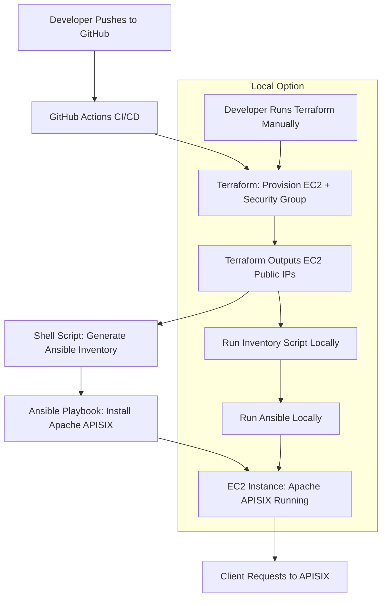

# Apache APISIX Deployment with Terraform & Ansible

## 🚀 Overview
This project provisions an **AWS EC2** instance using **Terraform** and configures **Apache APISIX** on it using **Ansible**. It also includes a GitHub Actions pipeline for full CI/CD automation.



## 📦 Prerequisites
Install:
- [Terraform](https://developer.hashicorp.com/terraform/downloads)
- [Ansible](https://docs.ansible.com/)
- [AWS CLI](https://docs.aws.amazon.com/cli/)
- [`jq`](https://stedolan.github.io/jq/)
- Valid AWS credentials and SSH key (`~/.ssh/my-key.pem` and `my-key.pub`)

## 🛠️ Steps to Run Locally
1. Clone the repo and navigate to the folder
2. Run Terraform
3. Generate inventory with `scripts/update_inventory.sh`
4. Run `scripts/trigger_ansible.sh`

## ✅ Validate
- Visit: `http://<EC2_PUBLIC_IP>:9080`
- Create a route via curl:
  ```
  curl -X PUT http://<EC2_PUBLIC_IP>:9080/apisix/admin/routes/1 \
    -H "X-API-KEY: edd1c9f034335f136f87ad84b625c8f1" \
    -d '{"uri":"/demo","upstream":{"type":"roundrobin","nodes":{"httpbin.org:80":1}}}'
  ```
- Access it at: `http://<EC2_PUBLIC_IP>:9080/demo`

## 🧼 Cleanup
```bash
cd terraform
terraform destroy -auto-approve
```

## 🎯 Outcome
- **Terraform** provisions the environment on AWS (VPC, EC2, security groups, etc.).

- **Ansible** configures Apache APISIX and supporting tools on provisioned EC2 instances.

- **Apache APISIX** serves as a production-ready API Gateway that routes traffic securely to your microservices.